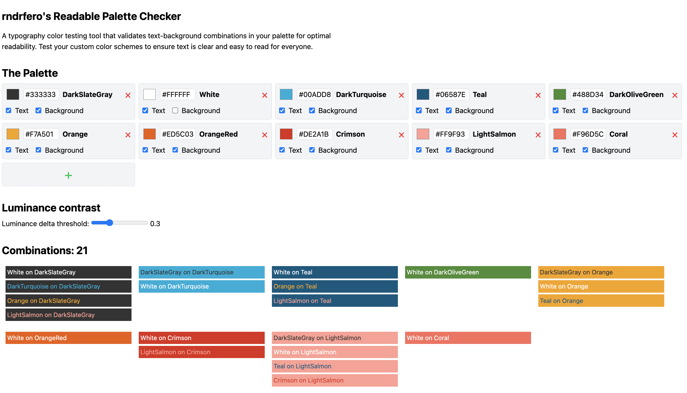

# Readable Palette Checker

A typography color testing tool that validates text-background combinations in your palette for optimal readability. Test your custom color schemes to ensure text is clear and easy to read for everyone.



## Features

- Test text-background color combinations for readability
- Generate and validate custom color palettes
- Visual feedback on readability scores
- Easy-to-use interface for color selection
- Export your readable color combinations

## Getting Started

### Prerequisites

- Node.js (v16 or higher)
- pnpm (recommended) or npm

### Installation

1. Clone the repository
```bash
git clone https://github.com/rndrfero/readable-palette-checker.git
cd readable-palette-checker
```

2. Install dependencies
```bash
pnpm install
```

3. Start the development server
```bash
pnpm dev
```

4. Open your browser and navigate to `http://localhost:3000`

## Built With

- [Nuxt 3](https://nuxt.com/) - The Vue.js Framework
- [Vue 3](https://vuejs.org/) - The Progressive JavaScript Framework
- [Tailwind CSS](https://tailwindcss.com/) - A utility-first CSS framework
- [TinyColor2](https://github.com/bgrins/TinyColor) - Color manipulation and conversion library

## License

This project is licensed under the MIT License - see the [LICENSE](LICENSE) file for details. 